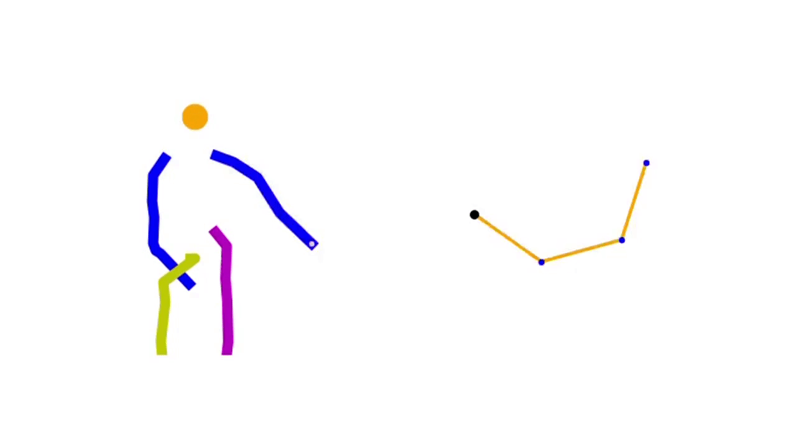
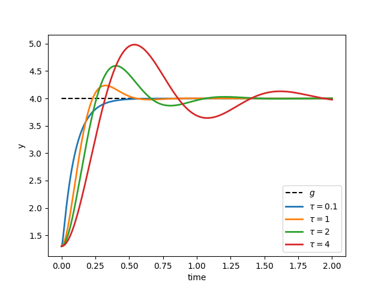
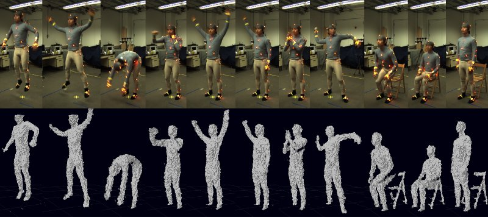
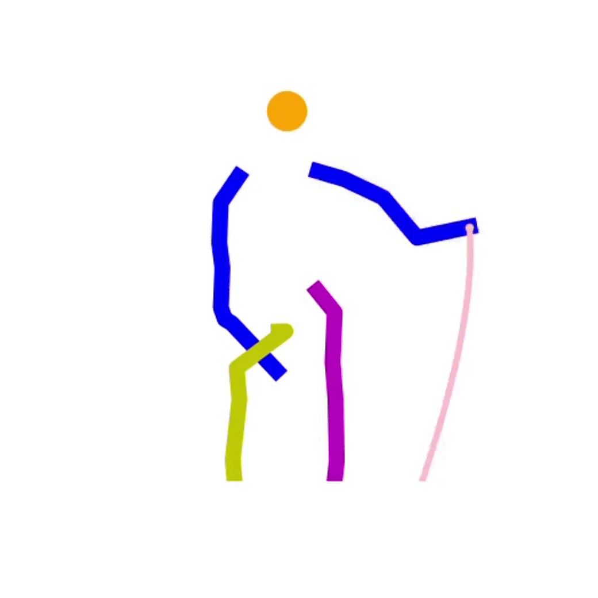
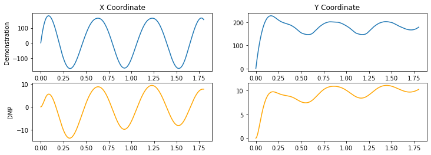

# DMPling

Implementation of the Dynamic Movement Primitives framework
in Python.

Based on the paper
> Ijspeert et al (2013). Dynamical Movement Primitives: Learning Attractor Models for Motor Behaviors. Neural Computing.
[\[pdf\]](https://homes.cs.washington.edu/~todorov/courses/amath579/reading/DynamicPrimitives.pdf)

## Dependencies
* numpy

## Overview
Dynamic Movement Primitives (DMPs) is a general framework for the description of demonstrated trajectories with a dynamical system. For example, in its simplest form, a DMP is PD controller representing an attraction towards a goal :

which can be written as

driving  to the position g with zero velocity, like a spring-damper system. The time constant  determines the convergence speed to the goal, as illustrated in this graph:

With this description and the appropriate values of the parameters , , , the system can be positioned to every possible position  from every initial condition  (globally stable). However simple this might seem, this dynamical system can be adapted so that the end-effector follows a specific path before reaching  and not only through a damped oscillation. The main idea is adding an extra term in the previous equation:

In order to force the system to end at the position , the forcing term is a learned trajectory (for example, with a regression method) multiplied with a *phase variable*  that maps the time  to an interval starting from 1 and ending at 0. This ensures that the force  will vanish at the end of the trajectory, leading the end-effector at :

where  are the learned weights and  can be basis functions used by the regressor. The force  is also multiplied by the term  that enables the system's response to be scaled spatially.

With this formulation, it is possible to imitate a human gesture if this is first recorded with some method (kinesthetic sensor, optical motion capture, etc). Then, this trajectory can be adapted to a humanoid robot or a robtic arm, enabling it to execute the same movement. In the following example, a recorded waving gesture of a human is used from the [**Berkeley Multimodal Human Action Database (MHAD)**](http://tele-immersion.citris-uc.org/berkeley_mhad=320).

<small>source: [**Berkeley Multimodal Human Action Database (MHAD)**](http://tele-immersion.citris-uc.org/berkeley_mhad)</small>

The motion is captured by a visual system of depth sensors and 48 markers on the demonstrator's body. The resulting data are in *c3d* format and contain 3D coordinates of all markers for every timestep.

Considering only the trajectory of the human's right hand (marker 24), a DMP was created for each movement dimension and trained them on their corresponding trajectory. The result was a trajectory in the 3D space that is an exact copy of the recorded one, but now in the form of a dynamical system. The spatial scaling of the DMP was tested by adapting the trajectory to the end-effector of a simulated 4-link planar robotic arm. To achieve this, the start and goal of the adapted DMP, that correspond to the initial condition  and  of the dynamical system respectively, have to be adjusted so that the robot can execute the movement. This adaptation is shown in the following graph. It shows the x-coordinate of the demonstrated trajectory (top) and the adapted with the DMP (bottom). We can see that topologically they are the same; the only change is their starting and ending position as well as their scale.

 The following animation shows how the translated and scaled trajectory is performed by a robot whose degrees of freedom and task-space is considerably different than that of the human.

We see that the robot follows the adapted trajectory but not exactly and in other settings may suffer from kinematic singularities. This is a major issue in movement imitation called correspondence problem which occurs when the demonstrator and the robot differ substantially regarding their configuration and DOFs. However, it is showed that DMPs have the potential to model demonstrated movements recorded only once (no need for iterative learning) and generalize them to different tasks.
